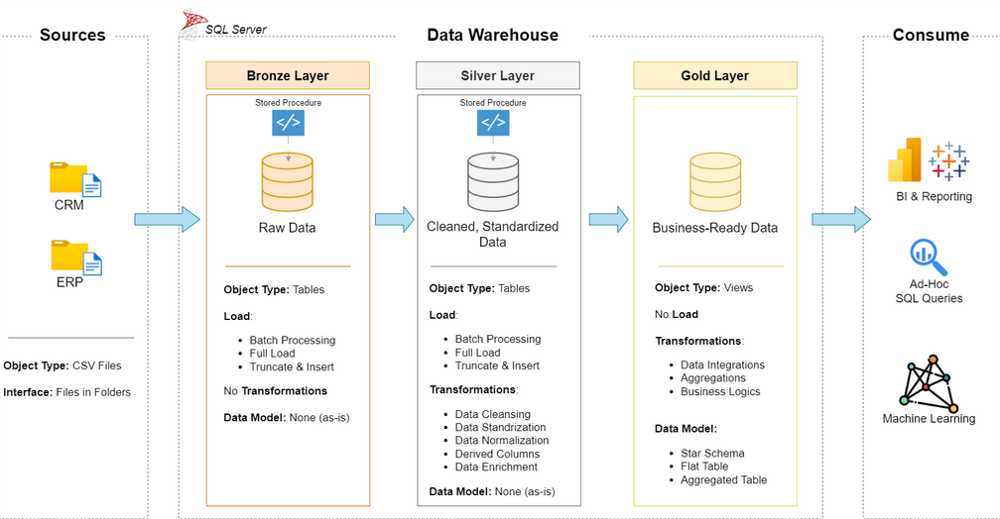

# Data Warehouse and Analytics Project

This is a learning project where I built a simple Data Warehouse in SQL Server and a basic analytics layer on top of it.  
The goal was to understand the full workflow: ingest raw data, clean and standardize it, model it for reporting, and run analytics queries.

## Project architecture (high level)

The project follows a simple Medallion Architecture flow:

**Sources (CSV files: ERP + CRM)**  
→ **Bronze Layer (raw tables, no transformations)**  
→ **Silver Layer (cleaned + standardized tables)**  
→ **Gold Layer (business-ready views, star schema)**  
→ **Consumption (BI/reporting, ad-hoc SQL, ML-ready outputs)**

## What’s included

- Data loaded from CSV files (ERP + CRM)
- Data warehouse structure based on the Medallion Architecture:
  - **Bronze** — raw data as-is
  - **Silver** — cleaned and standardized data
  - **Gold** — analytics-ready model (star schema)
- Fact and dimension tables for reporting
- SQL queries for analytics (sales, customers, products)

## What I learned (high level)

During this project I practiced:

- how a modern DWH is structured (Bronze / Silver / Gold)
- how to organize ETL scripts and layers
- basic data cleaning in SQL (NULL handling, duplicates, data types, standardization)
- dimensional modeling for analytics (fact/dim tables, star schema)
- writing SQL queries for business metrics and reporting

## Tech stack

- SQL Server (Express)
- SQL Server Management Studio (SSMS)

## Repository structure

